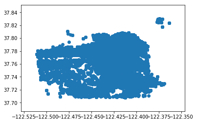
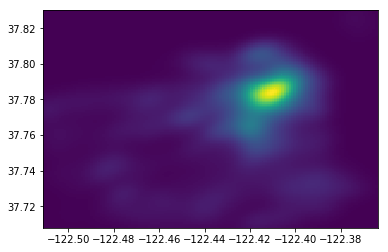
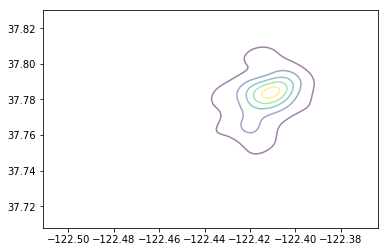

# Peace of Mind

Studies across many universities including the university of indiana psychologist Chris Meno 

Helicopter parenting can lead to

Children lacking necessary problem solving skills
Can affect their self esteem which can lead to depression and anxiety

Peace of mind is an application hoping to bridge the gap between completely hands free parenting and “helicopter parenting” allowing parents to not be able to see their children's location but knowing that the application will help the children avoid areas that might be dangerous for them by warning them and helping the navigate around. The parent only receives updates if the application thinks the child may be in danger along with notifying them if they reached the dentist or the store allowing parents to give their kids more agency and freedom which in turn gives them more self confidence and self reliance.  

> "When children aren't given the space to struggle through things on their own, they don't learn to problem-solve very well. They don't learn to be confident in their own abilities, and it can affect their self-esteem. The other problem with never having to struggle is that you never experience failure and can develop an overwhelming fear of failure and of disappointing others. Both the low self-confidence and the fear of failure can lead to depression or anxiety,"

## Uploading data

